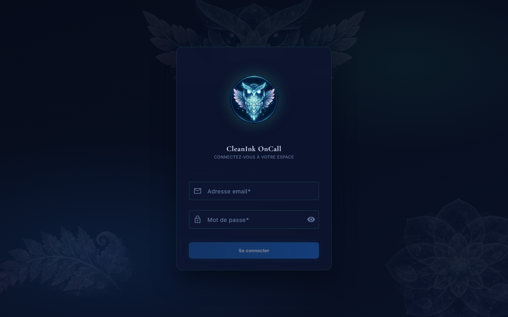
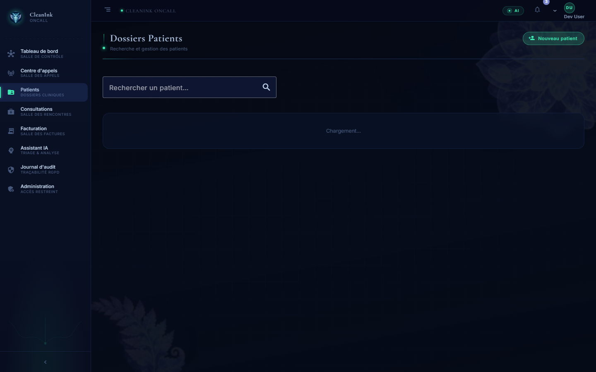
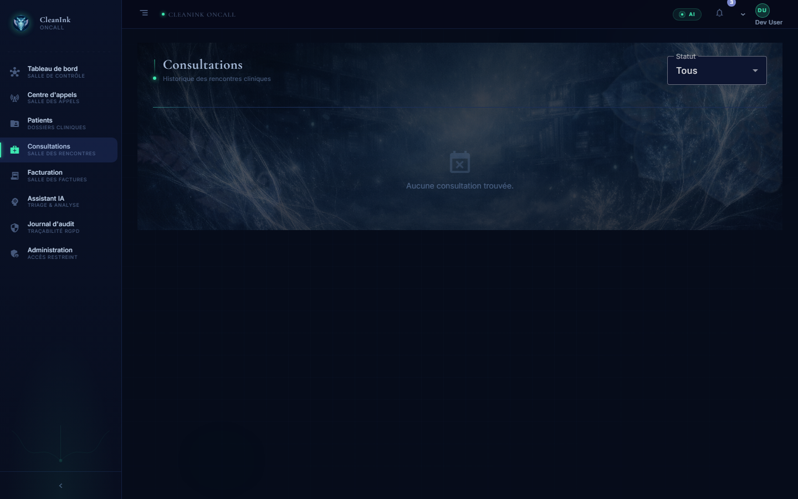
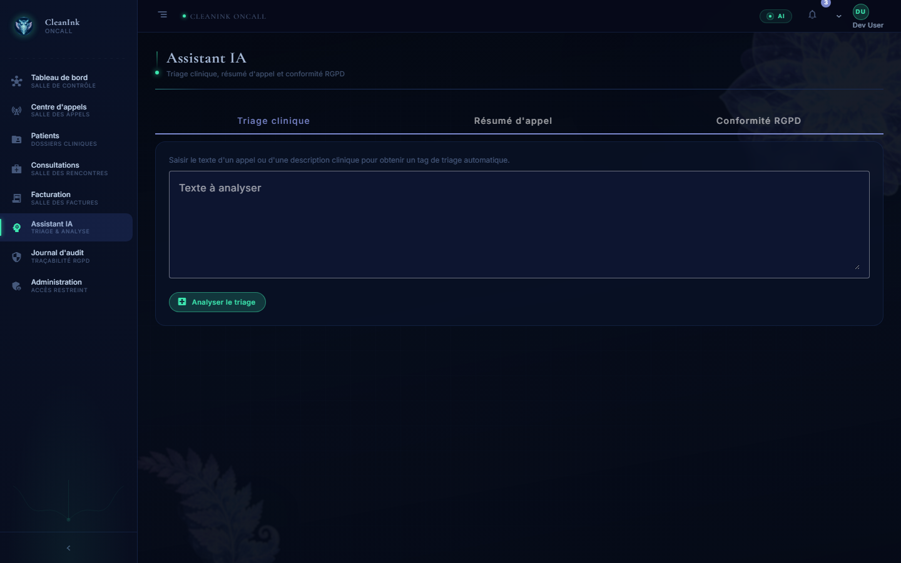
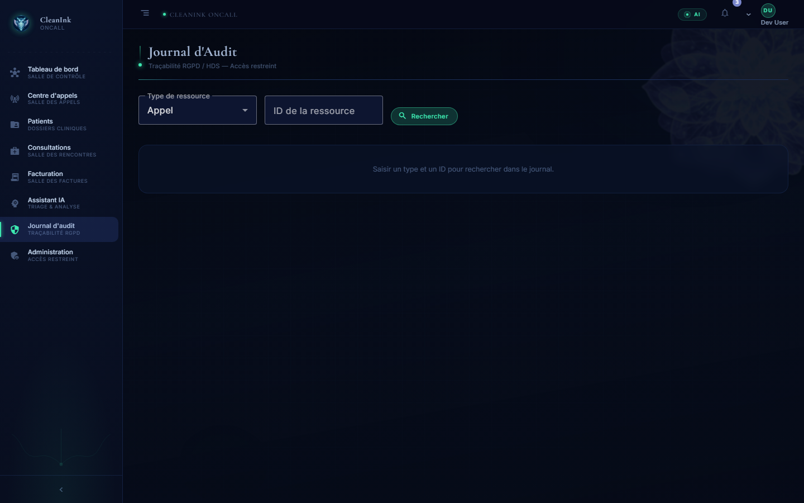
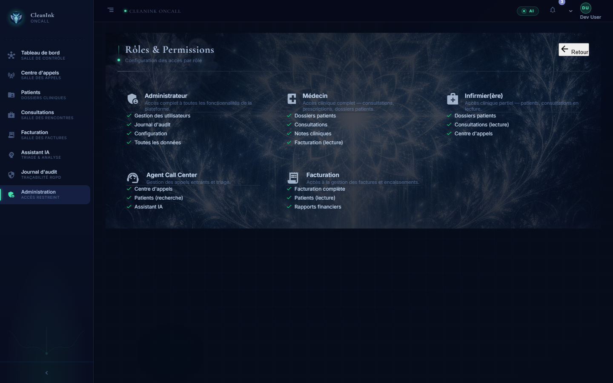

# CleanInk OnCall

Plateforme de gestion de permanences médicales de nuit — design system **Fractal Nocturne**.

---

## Stack

| Couche | Technologie |
|--------|-------------|
| Frontend | Angular 17, standalone components, Angular Material, TailwindCSS |
| Backend | .NET 9 / C#, architecture Clean (Domain → Application → Infrastructure → API) |
| Base de données | PostgreSQL 16 (Docker, port `5434`) |
| Auth | JWT simulé (dev) → à brancher sur le vrai `AuthService` |

---

## Aperçu — Design system Fractal Nocturne

Chaque "salle" possède son propre background atmosphérique, un voile gradient et des motifs fractals flottants (rosaces, fougères) en débordement à des tailles et opacités variées.

### Connexion — Fractal Nocturne Login



Page de connexion redessinée : carte glassmorphism sur fond nocturne, logo CIOC 220 px avec halo bioluminescent, 3 motifs fractals géants (chouette, fougère, rosace) en fond translucide.

### Salle de Contrôle (Dashboard)


KPIs temps-réel, activité en direct, agents IA (TriageAgent · SummaryAgent · ComplianceAgent).

### Salle des Appels (Centre d'appels)


File d'attente et appels en cours, avec background filaire lumineux.

### Dossiers Patients



Recherche patients FHIR — barre de recherche, tableau paginé, bouton "Nouveau patient".

### Consultations (Salle des Rencontres)



Historique des rencontres cliniques FHIR R4 — filtre par statut, motifs fractals en arrière-plan (z-index correct).

### Salle des Factures (Facturation)


Gestion des factures — KPIs montants, tableau avec statuts, fond fougère & réseau cristallin.

### Assistant IA



Transcription, triage et analyse IA — agents TriageAgent / SummaryAgent / ComplianceAgent.

### Journal d'Audit



Traçabilité RGPD / HDS — recherche par type de ressource et UUID, accès restreint admin.

### Accès Restreint (Administration)


Gestion utilisateurs — atmosphère brumeuse + arborescences fractales.

### Rôles & Permissions



5 rôles (Administrateur, Médecin, Infirmier, Agent Call Center, Facturation) avec leurs listes de permissions.

---

## Pages & fonctionnalités (v2)

| Route | Composant | Description |
|-------|-----------|-------------|
| `/dashboard` | `DashboardComponent` | KPIs temps-réel, activité, agents IA |
| `/call-center` | `CallCenterComponent` | File d'attente, filtres, statuts |
| `/call-center/:id` | `CallDetailComponent` | Détail d'un appel, IA, historique |
| `/billing` | `BillingComponent` | Liste des factures, filtres |
| `/billing/:id` | `InvoiceDetailComponent` | Détail facture — montants HT/TVA/TTC |
| `/patients` | `PatientsComponent` | Recherche patients FHIR |
| `/patients/:id` | `PatientDetailComponent` | Dossier complet du patient |
| `/encounters` | `EncountersComponent` | Consultations / rencontres cliniques |
| `/encounters/:id` | `EncounterDetailComponent` | Détail d'une consultation FHIR R4 |
| `/ai` | `AiComponent` | Assistant IA — transcription + triage |
| `/audit` | `AuditComponent` | Journal d'audit (admin) |
| `/admin` | `AdminComponent` | Gestion utilisateurs (admin) |
| `/admin/roles` | `AdminRolesComponent` | Rôles & permissions (admin) |

---

## Lancer le projet

### Prérequis
- Docker Desktop, Node.js 20+, .NET 9 SDK

### Frontend
```bash
npm install
npx ng serve
# → http://localhost:4200
# Login dev : n'importe quel email valide + mot de passe
```

### Backend + DB
```bash
cd backend
docker compose up -d        # PostgreSQL sur :5434
dotnet run --project src/CleanInk.OnCall.Api
# → http://localhost:5041
```

### Migrations EF Core
```bash
cd backend
dotnet ef database update \
  --project src/CleanInk.OnCall.Infrastructure \
  --startup-project src/CleanInk.OnCall.Api
```

---

## Architecture Frontend

```
src/
├── app/
│   ├── core/               # guards, services, interceptors
│   ├── features/
│   │   ├── auth/           # login
│   │   ├── dashboard/      # Salle de Contrôle
│   │   ├── call-center/    # Salle des Appels + détail /:id
│   │   ├── billing/        # Salle des Factures + détail /:id
│   │   ├── patients/       # Dossiers patients + détail /:id
│   │   ├── encounters/     # Consultations FHIR R4 + détail /:id
│   │   ├── ai/             # Assistant IA
│   │   ├── audit/          # Journal d'audit
│   │   └── admin/          # Utilisateurs + /roles
│   ├── layout/             # sidebar + header
│   └── shared/             # page-header, status-badge, etc.
├── assets/
│   └── images/
│       ├── backgrounds/    # 6 backgrounds atmosphériques
│       ├── motif_rosace.png
│       └── motif_fougere.png
└── styles.scss             # tokens --fn-* (Fractal Nocturne)
```

### Système de scène `.fn-scene`

```
.fn-scene                   ← wrapper full-bleed (margin négatif)
  ├── .fn-scene__bg         ← image de fond (opacity ~.45)
  ├── .fn-scene__veil       ← gradient sombre superposé
  ├── .fn-scene__deco ×3    ← motifs fractals absolus, débordement
  └── .fn-scene__content    ← contenu (z-index: 3, padding rétabli)
```

---

## Architecture Backend

```
backend/src/
├── CleanInk.OnCall.Domain/         # entités, value objects (Patient, Encounter, Invoice, CallCenter…)
├── CleanInk.OnCall.Application/    # use cases MediatR (Auth, Billing, CallCenter, Patients, Encounters…)
├── CleanInk.OnCall.Infrastructure/ # EF Core, PostgreSQL, repos
├── CleanInk.OnCall.Api/            # controllers, middleware, Program.cs
└── CleanInk.OnCall.Shared/         # utilitaires partagés
```

---

## Tokens CSS Fractal Nocturne

| Token | Valeur | Usage |
|-------|--------|-------|
| `--fn-abyss` | `#060c1a` | fond principal |
| `--fn-velvet` | `#0d1530` | cartes |
| `--fn-velvet-high` | `#1a2550` | hover |
| `--fn-bio` | `#3de8b0` | accent bioluminescent |
| `--fn-bio-dim` | `rgba(61,232,176,.2)` | borders subtiles |
| `--fn-font-title` | Cormorant Garamond | titres |
| `--fn-font-body` | Inter | corps |

---

## Commits clés

| Commit | Description |
|--------|-------------|
| `9ff2407` | feat(ui): Fractal Nocturne design system |
| `5d02ae5` | feat(ui): per-room backgrounds avec motifs fractals |
| `a3c1e8f` | feat: encounters, detail pages, admin roles, app-routing complet |
| `HEAD`    | feat: login redesign Fractal Nocturne, logo CIOC, sidebar Consultations, z-index fix, screenshots |

---

## Conventions

- Modules en **lazy loading** obligatoire
- Composants **standalone** (imports directs)
- Services `providedIn: 'root'` sauf exceptions
- Styles CSS-in-component pour les overrides locaux, global `styles.scss` pour les tokens
- Typage TypeScript strict — pas de `any`
