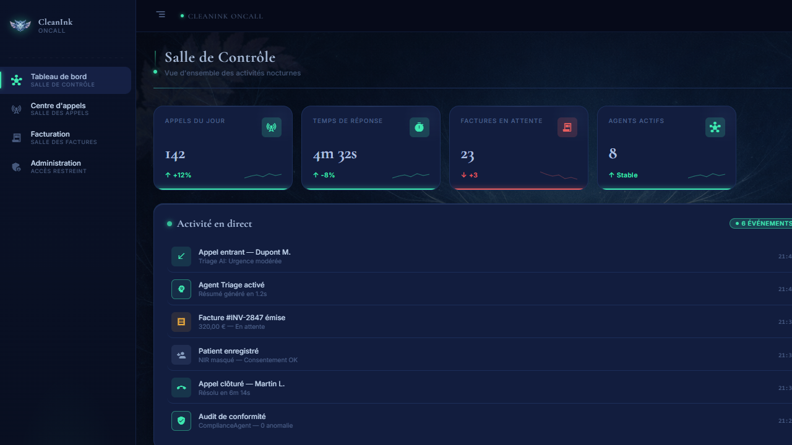
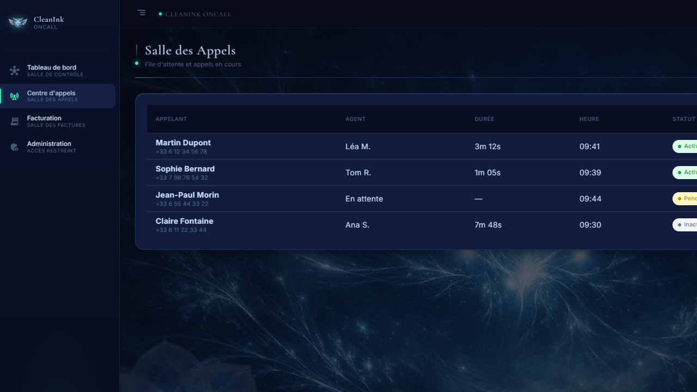
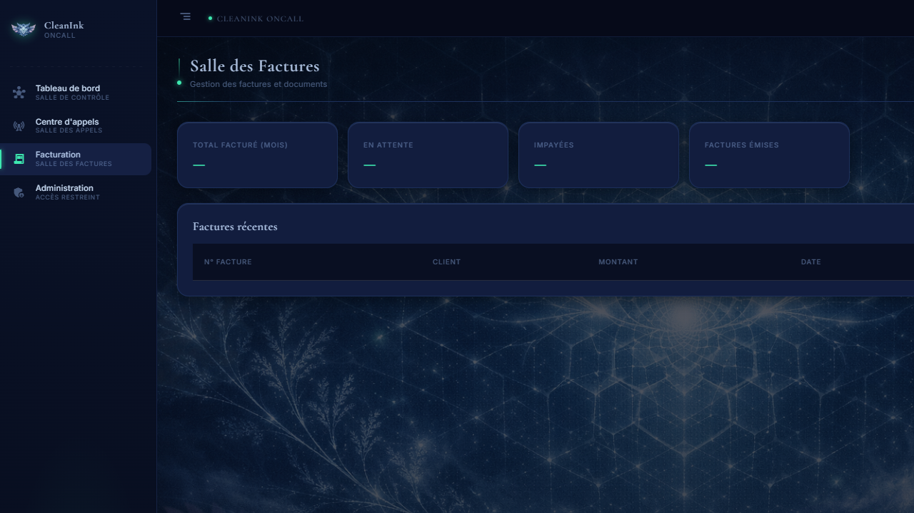
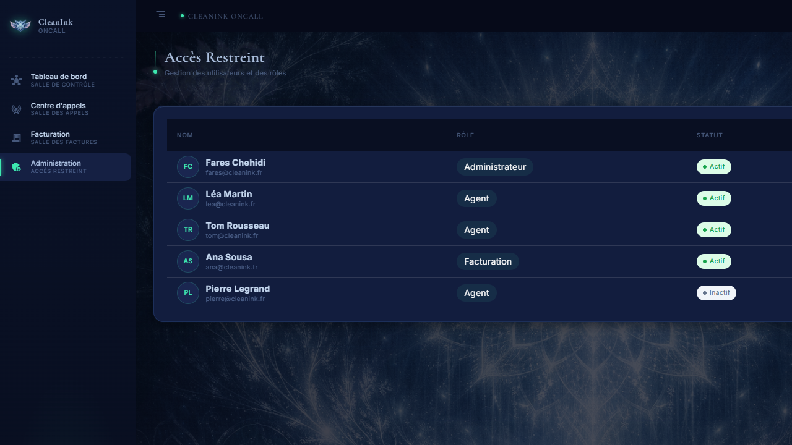

# CleanInk OnCall

Plateforme de gestion de permanences médicales de nuit — design system **Fractal Nocturne**.

---

## Stack

| Couche | Technologie |
|--------|-------------|
| Frontend | Angular 17, standalone components, Angular Material, TailwindCSS |
| Backend | .NET 9 / C#, architecture Clean (Domain → Application → Infrastructure → API) |
| Base de données | PostgreSQL 16 (Docker, port `5434`) |
| Auth | JWT simulé (dev) → à brancher sur le vrai `AuthService` |

---

## Aperçu — Design system Fractal Nocturne

Chaque "salle" possède son propre background atmosphérique, un voile gradient et des motifs fractals flottants (rosaces, fougères) en débordement à des tailles et opacités variées.

### Salle de Contrôle (Dashboard)



KPIs temps-réel, activité en direct, agents AI.

### Salle des Appels (Centre d'appels)



File d'attente et appels en cours, avec background filaire lumineux.

### Salle des Factures (Facturation)



Gestion des factures — fond fougère & réseau cristallin.

### Accès Restreint (Administration)



Gestion utilisateurs & rôles — atmosphère brumeuse + arborescences fractales.

---

## Lancer le projet

### Prérequis
- Docker Desktop, Node.js 20+, .NET 9 SDK

### Frontend
```bash
npm install
npx ng serve
# → http://localhost:4200
# Login dev : n'importe quel email valide + mot de passe
```

### Backend + DB
```bash
cd backend
docker compose up -d        # PostgreSQL sur :5434
dotnet run --project src/CleanInk.OnCall.Api
# → http://localhost:5041
```

### Migrations EF Core
```bash
cd backend
dotnet ef database update \
  --project src/CleanInk.OnCall.Infrastructure \
  --startup-project src/CleanInk.OnCall.Api
```

---

## Architecture Frontend

```
src/
├── app/
│   ├── core/               # guards, services, interceptors
│   ├── features/
│   │   ├── auth/           # login
│   │   ├── dashboard/      # Salle de Contrôle
│   │   ├── call-center/    # Salle des Appels
│   │   ├── billing/        # Salle des Factures
│   │   └── admin/          # Accès Restreint
│   ├── layout/             # sidebar + header
│   └── shared/             # page-header, status-badge, etc.
├── assets/
│   └── images/
│       ├── backgrounds/    # 6 backgrounds atmosphériques
│       ├── motif_rosace.png
│       └── motif_fougere.png
└── styles.scss             # tokens --fn-* (Fractal Nocturne)
```

### Système de scène `.fn-scene`

```
.fn-scene                   ← wrapper full-bleed (margin négatif)
  ├── .fn-scene__bg         ← image de fond (opacity ~.45)
  ├── .fn-scene__veil       ← gradient sombre superposé
  ├── .fn-scene__deco ×3    ← motifs fractals absolus, débordement
  └── .fn-scene__content    ← contenu (z-index: 3, padding rétabli)
```

---

## Architecture Backend

```
backend/src/
├── CleanInk.OnCall.Domain/         # entités, value objects
├── CleanInk.OnCall.Application/    # use cases, DTOs, interfaces
├── CleanInk.OnCall.Infrastructure/ # EF Core, PostgreSQL, repos
├── CleanInk.OnCall.Api/            # controllers, middleware, Program.cs
└── CleanInk.OnCall.Shared/         # utilitaires partagés
```

---

## Tokens CSS Fractal Nocturne

| Token | Valeur | Usage |
|-------|--------|-------|
| `--fn-abyss` | `#060c1a` | fond principal |
| `--fn-velvet` | `#0d1530` | cartes |
| `--fn-velvet-high` | `#1a2550` | hover |
| `--fn-bio` | `#3de8b0` | accent bioluminescent |
| `--fn-bio-dim` | `rgba(61,232,176,.2)` | borders subtiles |
| `--fn-font-title` | Cormorant Garamond | titres |
| `--fn-font-body` | Inter | corps |

---

## Commits clés

| Commit | Description |
|--------|-------------|
| `9ff2407` | feat(ui): Fractal Nocturne design system |
| `5d02ae5` | feat(ui): per-room backgrounds avec motifs fractals |
| `HEAD` | fix(ui): opacité backgrounds + min-height scènes |

---

## Conventions

- Modules en **lazy loading** obligatoire
- Composants **standalone** (imports directs)
- Services `providedIn: 'root'` sauf exceptions
- Styles CSS-in-component pour les overrides locaux, global `styles.scss` pour les tokens
- Typage TypeScript strict — pas de `any`
